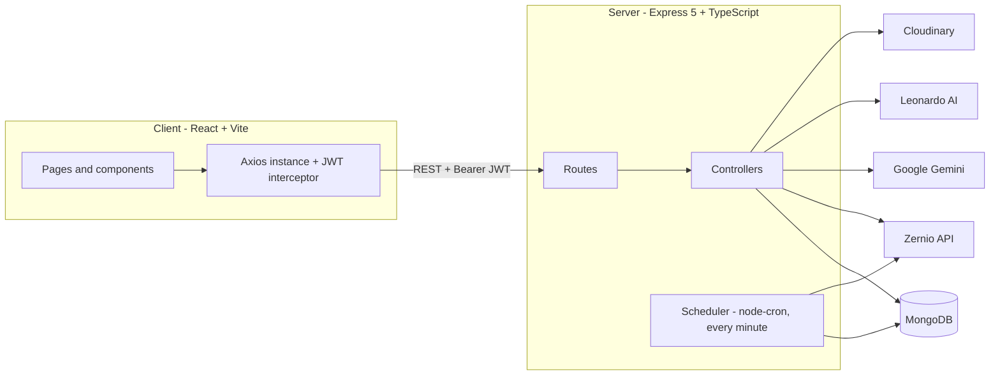
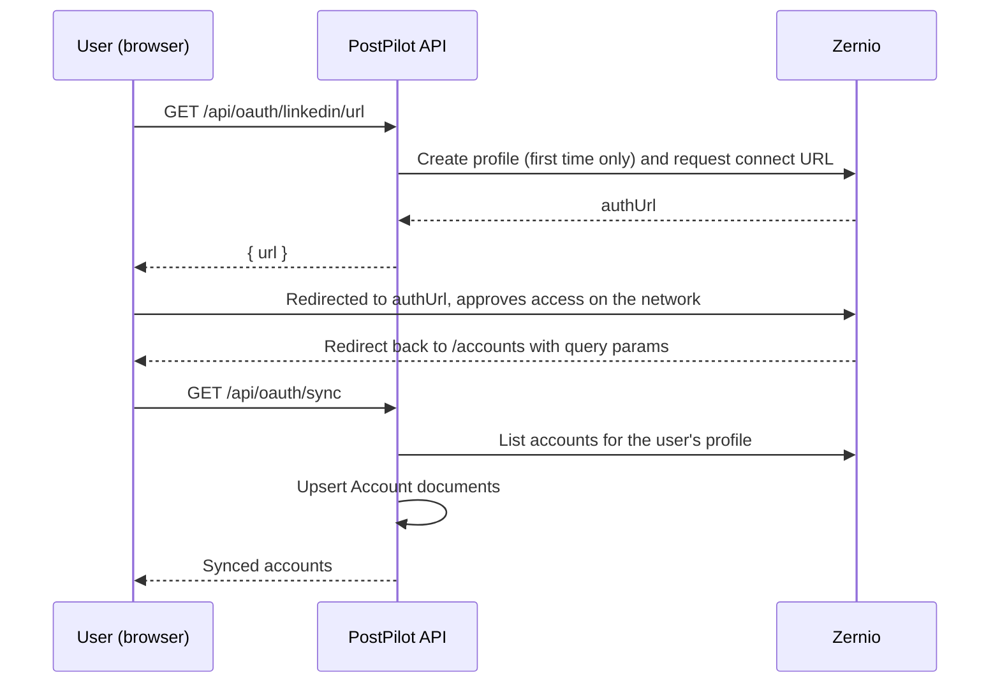
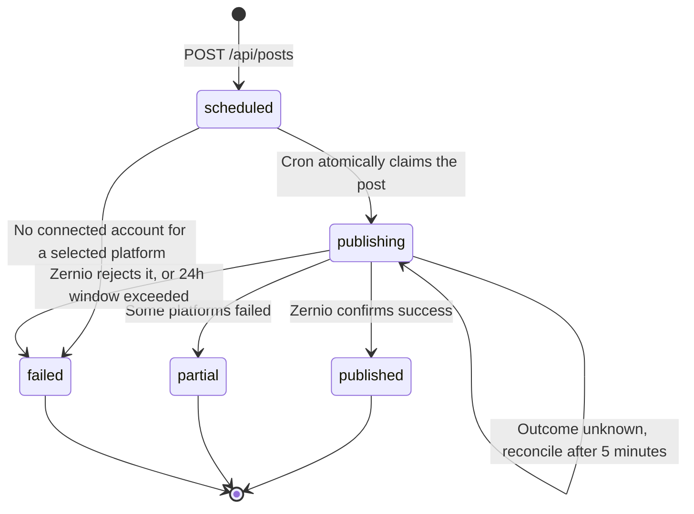

# PostPilot — Social Media Automation Platform

> Write, generate, schedule and publish social media posts from one dashboard. PostPilot combines an AI content composer (text + images) with a reliable background scheduler that publishes to **X / Twitter, LinkedIn, Facebook and Instagram**.


---

## Table of Contents

- [Overview](#overview)
- [Features](#features)
- [Tech Stack](#tech-stack)
- [Architecture](#architecture)
- [Project Structure](#project-structure)
- [Getting Started](#getting-started)
- [Environment Variables](#environment-variables)
- [External Services Setup](#external-services-setup)
- [API Reference](#api-reference)
- [Data Models](#data-models)
- [How the Scheduler Works](#how-the-scheduler-works)
- [Frontend Guide](#frontend-guide)
- [Scripts](#scripts)
- [Deployment Notes](#deployment-notes)
- [Security Notes and Known Limitations](#security-notes-and-known-limitations)
- [Roadmap](#roadmap)
- [Contributing](#contributing)
- [Author](#author)

---

## Overview

PostPilot is a full-stack **MERN** (MongoDB, Express, React, Node.js) application written entirely in **TypeScript**. A user signs up, connects their social accounts, and then either writes posts manually or asks the AI to generate a caption (and optionally an image). Posts are queued for a future date and time, and a background job publishes them automatically.

Some design choices worth knowing up front:

- **PostPilot never stores social-network OAuth tokens itself.** Account connection and publishing go through [**Zernio**](https://zernio.com), a unified social-posting API (via the official `@zernio/node` SDK). PostPilot stores only Zernio account IDs.
- **AI text** is generated by **Google Gemini**; **AI images** are generated by **Leonardo AI** and then copied to **Cloudinary** so they have a permanent public URL.
- **Publishing is built to be crash-safe.** The scheduler uses atomic claims, idempotency keys and reconciliation against Zernio so a post is never published twice and never silently lost (see [How the Scheduler Works](#how-the-scheduler-works)).

---

## Features

**Authentication**
- Email + password sign-up and sign-in (passwords hashed with bcrypt).
- JWT sessions (30-day expiry) with automatic client-side logout on expiry or a 401 response.

**Social account management**
- Connect X / Twitter, LinkedIn, Facebook and Instagram through a hosted OAuth flow.
- Sync connected accounts into the local database and disconnect them at any time (disconnecting also removes the account from Zernio).

**Post scheduler**
- Compose a post, pick one or more platforms, attach an optional image or video (up to 50 MB), and choose a date/time.
- Live queue split into **Upcoming**, **Published** and **Needs attention** (failed or partially published, with the error message shown). The queue refreshes every 10 seconds.
- Instagram posts require media — enforced on both client and server.

**AI Composer**
- Enter an idea, choose a tone (Professional, Creative, Funny, Minimalist, Excited) and optionally enable AI image generation.
- Gemini writes the post with hashtags and a matching image prompt; Leonardo AI renders the image; Cloudinary hosts it.
- Every generation is saved to a history, and any past generation can be scheduled with one click.
- Built-in retry/backoff for temporary Gemini outages and clear messaging when API quota is exhausted.

**Dashboard**
- At-a-glance counters: scheduled posts, published posts, posts needing attention, connected accounts.
- Recent-activity feed (the 10 latest publish events).

**Landing page**
- Marketing site with hero, features, how-it-works, testimonials, pricing and call-to-action sections.

<!-- Tip: add screenshots of the Dashboard, Scheduler and AI Composer here, e.g.  -->

---

## Tech Stack

| Layer | Technology |
| --- | --- |
| **Frontend** | React 19, Vite 8, TypeScript, React Router 7, Tailwind CSS 4, Axios, react-hot-toast, lucide-react, React Compiler (via Babel plugin) |
| **Backend** | Node.js, Express 5, TypeScript (ESM, `nodenext`), Mongoose 9, node-cron, Multer, Helmet, express-rate-limit, bcrypt, jsonwebtoken |
| **Database** | MongoDB |
| **AI** | Google Gemini (`@google/genai`) for text, Leonardo AI (REST) for images |
| **Social publishing** | Zernio (`@zernio/node`) |
| **Media storage** | Cloudinary |
| **Tooling** | `tsx` + `nodemon` (server dev), `tsc` (server build), ESLint 10 + typescript-eslint (client) |

---

## Architecture



### Connecting a social account



### Generating an AI post

1. The client sends `{ prompt, tone, generateImage }` to `POST /api/posts/generate`.
2. The server asks **Gemini** for a JSON response containing the post `content` (with hashtags) and an `imagePrompt`. Transient errors (429/500/503, "overloaded") are retried with backoff and fall back across candidate models; quota exhaustion returns a clear `429`.
3. If `generateImage` is on, the server submits `imagePrompt` to **Leonardo AI**, polls every 5 seconds (3-minute timeout), then uploads the finished image to **Cloudinary** (`ai-generations` folder).
4. The result is saved as a `Generation` document and returned to the client, where it can be scheduled.

---

## Project Structure

```
PostPilot-Social-Media-Automation-Platform-App/
├── client/                          # React + Vite + TypeScript frontend
│   ├── public/                      # Favicon, logo, icon sprites
│   ├── src/
│   │   ├── api/axios.ts             # Axios instance, JWT header + 401 handling
│   │   ├── assets/assets.tsx        # PLATFORMS metadata (id, name, icon) + images
│   │   ├── components/
│   │   │   ├── Home/                # Landing page sections (Hero, Features, Pricing, ...)
│   │   │   ├── AccountList.tsx      # Connected accounts list
│   │   │   ├── Layout.tsx           # Auth guard + app shell (sidebar / top bar)
│   │   │   ├── PlatformPickerModal.tsx
│   │   │   └── Sidebar.tsx
│   │   ├── context/                 # AuthContext, AuthProvider, useAuth
│   │   ├── pages/                   # Home, Login, Dashboard, Accounts, Scheduler, AiComposer
│   │   ├── App.tsx                  # Route table
│   │   ├── main.tsx                 # Entry point (Router + AuthProvider)
│   │   └── index.css
│   ├── index.html
│   ├── vite.config.ts
│   └── package.json
│
└── server/                          # Express + TypeScript backend
    ├── config/
    │   ├── cloudinary.ts            # Cloudinary client
    │   ├── db.ts                    # MongoDB connection
    │   ├── jwt.ts                   # JWT secret
    │   ├── multer.ts                # In-memory upload, images/videos only, 50 MB cap
    │   └── zernio.ts                # Zernio SDK client
    ├── controllers/
    │   ├── AuthControllers.ts       # register / login
    │   ├── SocialAuthControllers.ts # Zernio connect URL + account sync
    │   ├── AccountControllers.ts    # list / add / disconnect accounts
    │   ├── postControllers.ts       # AI generation, list posts, schedule post
    │   └── activityControllers.ts   # recent activity feed
    ├── middlewares/authMiddleware.ts # `protect` — JWT verification
    ├── models/                      # User, Account, Post, Generation, ActiveLog
    ├── routes/                      # Express routers, one per resource
    ├── services/schedulerService.ts # Cron-based publishing engine
    ├── server.ts                    # App bootstrap
    ├── tsconfig.json
    └── package.json
```

> The server uses native ES modules with `"module": "nodenext"`, so **relative imports must end in `.js`** (e.g. `import User from "../models/User.js"`) even though the source files are `.ts`.

---

## Getting Started

### Prerequisites

- **Node.js** 22 LTS or newer recommended (the Vite 8 / TypeScript toolchain expects a modern Node) and **npm**
- A **MongoDB** database — local install or a free [MongoDB Atlas](https://www.mongodb.com/atlas) cluster
- Accounts/API keys for the [external services](#external-services-setup) below

### 1. Clone the repository

```bash
git clone https://github.com/Ayush-verma25/PostPilot-Social-Media-Automation-Platform-App.git
cd PostPilot-Social-Media-Automation-Platform-App
```

### 2. Configure the server

```bash
cd server
npm install
```

Create `server/.env` (see [Environment Variables](#environment-variables) for what each value means):

```env
PORT=5000
MONGODB_URI=mongodb://localhost:27017/postpilot
JWT_SECRET=replace-with-a-long-random-string

ZERNIO_API_KEY=your_zernio_api_key
GEMINI_API_KEY=your_gemini_api_key
LEONARDO_API_KEY=your_leonardo_api_key

CLOUDINARY_CLOUD_NAME=your_cloud_name
CLOUDINARY_API_KEY=your_cloudinary_key
CLOUDINARY_API_SECRET=your_cloudinary_secret
```

Start the API in development mode (auto-restarts on change):

```bash
npm run server
```

You should see `MongoDB Connected`, `Scheduler service initialized` and `Server is running at http://localhost:5000`.

### 3. Configure the client

Open a **second terminal**:

```bash
cd client
npm install
```

Create `client/.env`:

```env
VITE_API_BASE_URL=http://localhost:5000
```

Start the dev server:

```bash
npm run dev
```

Open the URL Vite prints (by default **http://localhost:5173**), create an account on the sign-in page, and you're in.

---

## Environment Variables

### Server (`server/.env`)

| Variable | Required | Description |
| --- | --- | --- |
| `MONGODB_URI` | Yes | MongoDB connection string. The server exits on startup if it cannot connect. |
| `JWT_SECRET` | Yes | Secret used to sign JWTs. **Always set this** — if missing, the code falls back to an insecure hard-coded default. |
| `ZERNIO_API_KEY` | Yes | Zernio API key; needed to connect accounts and publish posts. |
| `GEMINI_API_KEY` | For AI Composer | Google Gemini API key for post text. |
| `LEONARDO_API_KEY` | For AI images | Leonardo AI key. Only needed when "AI Images" is toggled on. |
| `CLOUDINARY_CLOUD_NAME` `CLOUDINARY_API_KEY` `CLOUDINARY_API_SECRET` | For media | Needed for AI-generated images **and** for any image/video uploaded in the Scheduler. |
| `PORT` | No | API port. Defaults to `5000`. |
| `GEMINI_MODEL` | No | Preferred Gemini model. It is tried first, then the built-in fallbacks defined in `server/controllers/postControllers.ts`. Check those names against Google's current model list. |

### Client (`client/.env`)

| Variable | Required | Description |
| --- | --- | --- |
| `VITE_API_BASE_URL` | No | Base URL of the API. Defaults to `http://localhost:5000`. Baked in at build time. |

> `.env` files are listed in `.gitignore` — never commit them.

---

## External Services Setup

| Service | Used for | Where to get credentials |
| --- | --- | --- |
| **MongoDB** | Application data | [mongodb.com/atlas](https://www.mongodb.com/atlas) or a local `mongod` |
| **Zernio** | OAuth connection + publishing to social networks | [zernio.com](https://zernio.com) — create an account and generate an API key |
| **Google Gemini** | AI post text | [aistudio.google.com](https://aistudio.google.com) — create an API key |
| **Leonardo AI** | AI post images | [leonardo.ai](https://leonardo.ai) — API access and key from your account |
| **Cloudinary** | Hosting uploaded and AI-generated media | [cloudinary.com](https://cloudinary.com) — Cloud name, API key and secret are on the dashboard |

The app degrades gracefully: without Leonardo/Cloudinary keys you can still generate text-only posts, and without Gemini you can still write and schedule posts manually.

---

## API Reference

Base URL: `http://localhost:5000`. All `/api/*` routes are rate-limited to **100 requests per 15 minutes per IP**. Routes marked 🔒 require an `Authorization: Bearer <token>` header.

| Method | Endpoint | Auth | Description |
| --- | --- | :---: | --- |
| `GET` | `/` | — | Health check (`Server is Live!`) |
| `POST` | `/api/auth/register` | — | Create an account; returns user + JWT |
| `POST` | `/api/auth/login` | — | Sign in; returns user + JWT |
| `GET` | `/api/oauth/:platform/url` | 🔒 | Get the hosted OAuth URL to connect a platform (`twitter`, `linkedin`, `facebook`, `instagram`) |
| `GET` | `/api/oauth/sync` | 🔒 | Pull connected accounts from Zernio into the database |
| `GET` | `/api/accounts` | 🔒 | List the user's accounts |
| `POST` | `/api/accounts` | 🔒 | Manually add an account record (`platform`, `handle`, `avatarUrl`) |
| `DELETE` | `/api/accounts/:id` | 🔒 | Disconnect an account (also deletes it from Zernio) |
| `GET` | `/api/posts` | 🔒 | List the user's posts |
| `POST` | `/api/posts` | 🔒 | Create a scheduled post (`multipart/form-data`, optional `media` file) |
| `POST` | `/api/posts/generate` | 🔒 | Generate a post (and optional image) with AI |
| `GET` | `/api/posts/generations` | 🔒 | List past AI generations, newest first |
| `GET` | `/api/activity` | 🔒 | 10 most recent activity events |

### Examples

**Register**

```bash
curl -X POST http://localhost:5000/api/auth/register \
  -H "Content-Type: application/json" \
  -d '{"name":"Jane","email":"jane@example.com","password":"secret123"}'
```

```json
{ "_id": "664f...", "name": "Jane", "email": "jane@example.com", "token": "<jwt>" }
```

**Schedule a post with media**

```bash
curl -X POST http://localhost:5000/api/posts \
  -H "Authorization: Bearer <token>" \
  -F "content=Hello from PostPilot!" \
  -F 'platforms=["linkedin","twitter"]' \
  -F "scheduledFor=2027-01-15T09:30:00.000Z" \
  -F "status=scheduled" \
  -F "media=@./photo.jpg"
```

Validation rules enforced by the server:

- `status` must be `draft` or `scheduled`.
- `content` must be a non-empty string.
- `scheduledFor` must be a valid date **in the future**.
- `platforms` must be a non-empty array (a JSON string or comma-separated list is also accepted for form data) of supported values: `facebook`, `twitter`, `instagram`, `linkedin`, `facebook_page`, `linkedin_page`, `instagram_business`.
- Instagram targets require media (`media` file or a `mediaUrl`).
- Uploads must be `image/*` or `video/*`, max **50 MB**.

**Generate an AI post**

```bash
curl -X POST http://localhost:5000/api/posts/generate \
  -H "Authorization: Bearer <token>" \
  -H "Content-Type: application/json" \
  -d '{"prompt":"Launch of our eco-friendly coffee beans","tone":"Creative","generateImage":true}'
```

Returns the saved `Generation` (`prompt`, `content`, `mediaUrl`, `mediaType`, `tone`, timestamps). Useful error codes: `400` missing prompt/Gemini key, `429` Gemini quota exhausted, `502` Gemini/image generation failed, `503` image generation not configured.

Errors are returned as `{ "message": "..." }`.

---

## Data Models

| Model | Key fields |
| --- | --- |
| **User** | `name`, `email` (unique), `password` (bcrypt hash), `zernioProfileId` |
| **Account** | `user`, `platform`, `handle`, `zernioAccountId` (unique), `status` (`connected` / `disconnected`), `avatarurl`. Also has `accessToken`, `refreshToken`, `tokenExpiresAt` fields that the current Zernio-based flow does not populate. |
| **Post** | `user`, `content`, `mediaUrl`, `mediaType`, `platform[]`, `scheduledFor`, `status`, `publishError`, plus scheduler bookkeeping: `zernioIdempotencyKey`, `claimedAt`, `retryAt` |
| **Generation** | `user`, `prompt`, `content`, `mediaUrl`, `mediaType`, `tone` |
| **ActiveLog** | `user`, `actionType` (`POST_PUBLISHED` / `AI_REPLY`), `description`, `relatedPost`, `platform`, `aiGeneratedText` |

All models use Mongoose `timestamps` (`createdAt`, `updatedAt`).

---

## How the Scheduler Works

The scheduler (`server/services/schedulerService.ts`) starts with the API and runs on a **cron tick every minute**. It is the most carefully engineered part of the backend.



**Each tick**

1. Finds up to 50 posts whose `scheduledFor` has passed and that are either `scheduled` or stuck in `publishing` for more than 5 minutes.
2. Resolves the user's connected accounts for the post's platforms. If any selected platform has no connected account, the post is marked `failed` with a helpful message ("Connect an account for: ...").
3. **Atomically claims** the post (`findOneAndUpdate` from `scheduled` to `publishing`) and generates an **idempotency key**, so overlapping runs or multiple server instances cannot publish the same post twice.
4. Calls Zernio `createPost` (60 s timeout), tagging the request with `metadata.postPilotPostId`.
5. Records the outcome: `published` (and writes an `ActiveLog` entry), `partial`/`failed` (with per-platform error text in `publishError`), or leaves it as `publishing` when the result is unknown.

**Failure handling**

- Only clear client-side rejections (4xx, except 408/409/429) are treated as definitive failures.
- Timeouts, network errors, 5xx and rate limits are treated as *"unknown outcome"*. After 5 minutes the scheduler **reconciles** by searching Zernio for a post carrying the PostPilot tag; if found, it adopts that result, otherwise it retries with the **same idempotency key**.
- A post that cannot be confirmed within 24 hours of its scheduled time is marked `failed`.
- A `isRunning` guard prevents a slow tick from overlapping with the next one.

**Post statuses:** `draft`, `scheduled`, `publishing`, `published`, `partial`, `failed`. The scheduler only acts on `scheduled` (and stale `publishing`) posts.

---

## Frontend Guide

### Routes

| Path | Page | Access |
| --- | --- | --- |
| `/` | Landing page | Public |
| `/login` | Sign in / Sign up (toggle on the same page) | Public |
| `/dashboard` | Stats cards + recent activity | Authenticated |
| `/accounts` | Connect, sync and disconnect social accounts | Authenticated |
| `/schedule` | Compose manually, view the publishing queue | Authenticated |
| `/ai-composer` | Generate posts with AI, browse history, schedule | Authenticated |

Authenticated routes are wrapped in `Layout`, which redirects to `/login` when there is no valid session.

### Auth flow

- `AuthProvider` keeps `user` and `token` in React state and mirrors them to `localStorage`.
- On load and via a timer, the JWT's `exp` claim is decoded client-side so expired sessions are cleared automatically; changes in other browser tabs are synced via the `storage` event.
- `src/api/axios.ts` attaches `Authorization: Bearer <token>` to every request. A 401 on an authenticated request clears the session and dispatches an `auth:unauthorized` event that `AuthProvider` listens for.

### Adding a new platform to the UI

Platforms are defined once in `client/src/assets/assets.tsx` (`PLATFORMS`), and every picker in the app reads from that list. The server must also accept the platform id (see the enums in `Account` / `Post` models and the `supportedPlatforms` lists in the controllers).

---

## Scripts

### Server (`server/`)

| Command | Description |
| --- | --- |
| `npm run server` | Development mode — `nodemon` + `tsx`, restarts on changes |
| `npm run build` | Compile TypeScript to `server/dist` |
| `npm start` | Run the compiled build (`node dist/server.js`) |

### Client (`client/`)

| Command | Description |
| --- | --- |
| `npm run dev` | Vite dev server with HMR |
| `npm run build` | Type-check (`tsc -b`) and produce a production build in `client/dist` |
| `npm run preview` | Serve the production build locally |
| `npm run lint` | Run ESLint |

---

## Deployment Notes

- **Two deployables.** The API does not serve the frontend. Host `client/dist` on any static host (Vercel, Netlify, Cloudflare Pages, S3 + CDN, ...) and the API on a Node host (Render, Railway, Fly.io, a VPS, ...).
- **Set `VITE_API_BASE_URL` at build time** to your deployed API URL — Vite inlines it into the bundle.
- **SPA rewrites.** Configure the static host to serve `index.html` for unknown paths so React Router routes like `/dashboard` work on refresh. This also matters for the OAuth redirect back to `/accounts`.
- **Keep the API process running.** The scheduler lives inside the API process, so hosts that put the app to sleep (or serverless platforms) will not publish posts on time. A single always-on instance is the simplest setup; the atomic claim logic is designed so only one instance can claim a given post if you scale out.
- **Behind a reverse proxy?** Configure Express `trust proxy` so the rate limiter sees real client IPs.
- **CORS** is currently open to all origins (`cors()`); restrict it to your frontend origin in production.

---

## Security Notes and Known Limitations

Things to be aware of before using this in production:

- **Set a strong `JWT_SECRET`.** The code falls back to a hard-coded value when it is missing.
- **Open CORS** and **JWTs stored in `localStorage`** (30-day lifetime) — consider restricting origins and shortening/refreshing tokens.
- **Minimal input validation on sign-up** — no server-side email-format or password-strength checks yet.
- **Rate limit vs. polling.** The API allows 100 requests / 15 min / IP, while the Scheduler page polls `/api/posts` every 10 seconds (about 90 requests per 15 minutes on its own). Heavy use of that page can trigger `429` responses; raise the limit, poll less often, or scope the limiter per route.
- **Post length.** The manual composer caps content at 280 characters for every platform, but AI-generated posts are not length-checked, so a long AI post sent to X / Twitter may be rejected and appear under *Needs attention*.
- **Drafts.** The API accepts `status: "draft"`, but the UI does not yet offer a draft workflow, and there are no endpoints to edit or cancel a scheduled post.
- **Platform variants.** The backend accepts `facebook_page`, `linkedin_page` and `instagram_business`, but the UI currently exposes the four base platforms.
- **Pricing tiers are presentational.** The plans on the landing page (account and post limits, AI credits) are not enforced by the backend yet.
- **No automated tests or CI** are set up yet.

---

## Roadmap

- [ ] Stripe subscription billing and enforcement of plan limits (Starter / Pro / Agency)
- [ ] Draft posts, plus edit and cancel for scheduled posts
- [ ] Per-platform content validation (character limits, media rules)
- [ ] Post analytics / engagement metrics
- [ ] AI-assisted replies (the `AI_REPLY` activity type is already reserved)
- [ ] Unit / integration tests and a CI pipeline
- [ ] Docker setup for one-command local development

---

## Contributing

Contributions are welcome.

1. Fork the repository and create a feature branch (this project merges work into `main` via pull requests from the `developement` branch).
2. Make your changes, keeping TypeScript strict mode happy (`npm run build` in `server/`, `npm run build` and `npm run lint` in `client/`).
3. Open a pull request describing what changed and why.

---

## Author

Built by [**@Ayush-verma25**](https://github.com/Ayush-verma25).

If you find this project useful, consider giving it a ⭐ on GitHub.